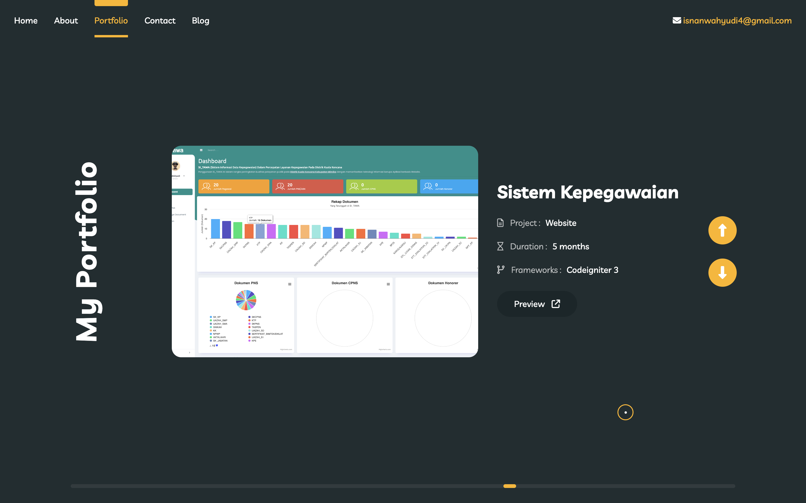

# port_SmartPath

## Referensi Styling
<!-- Fontawesome -->
[Font Awesome](https://cdnjs.com/libraries/font-awesome)
<a href="https://github.com/FortAwesome/Font-Awesome?utm_source=cdnjs&utm_medium=cdnjs_link&utm_campaign=cdnjs_library" target="_blank">Font Awesome GitHub</a>

<!-- Animate -->
[Animate.css](https://cdnjs.com/libraries/animate.css/3.5.1)

<!-- Bootstrap -->
[Bootstrap](https://getbootstrap.com/docs/5.3/getting-started/introduction/)

<!-- Devicon -->
[Devicon](https://devicon.dev/)

<!-- jquery.mCustomScrollbar -->
[jquery.mCustomScrollbar](https://manos.malihu.gr/jquery-custom-content-scroller/)

<!-- Swiper -->
[Swiper](https://swiperjs.com/get-started#install-from-npm)

<!-- jquery -->
[jQuery](https://cdnjs.com/libraries/jquery)

## Screenshot
Berikut adalah gambar hasil:

